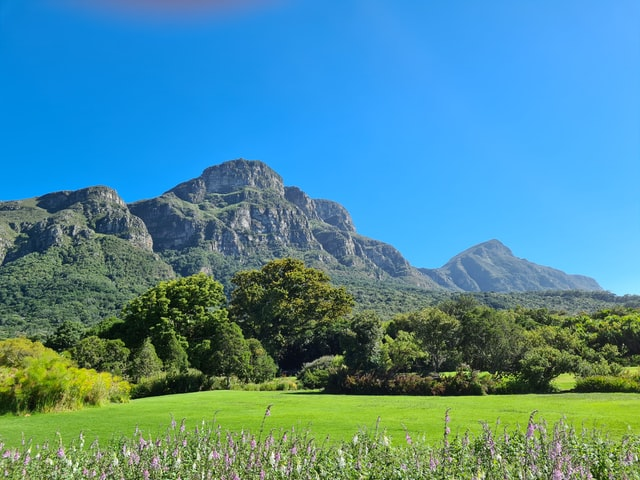
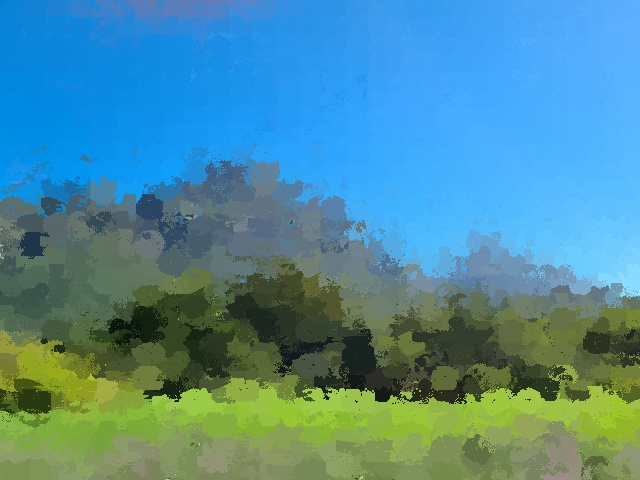
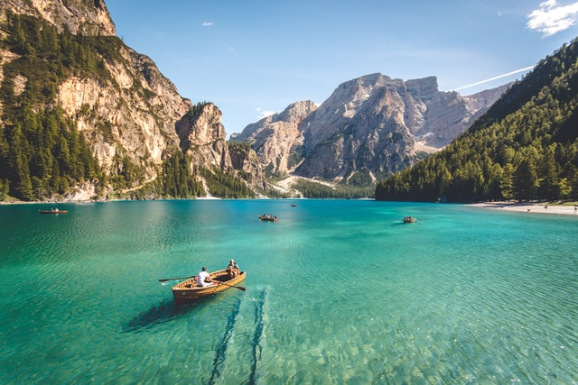

# NPR-Painting
Non-Photorealistic Rendering (NPR) filter - Oil Painting style


## Quick start

**File:** ```main.py````

```python
main("input/im1.jpg", "output/out1.jpg", iterations=6, live=False)
```

- **Iterations**: level of details (time will increase) [2,3,4,5,6,7]
- **live**: if True, you can see the live process of painting (time will increase)


## Output


| Original | Processed |
|----------|-----------|
|     |      |
|     |      |
|     |      |   